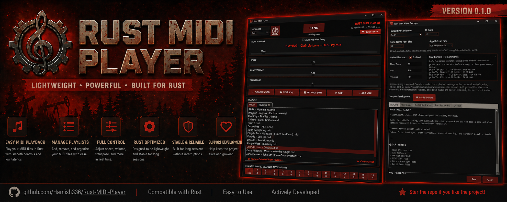

# Rust MIDI Player

A lightweight, stable MIDI player built specifically for Rust.

Designed for reliable timing, low overhead, and clean playback so you can load a song and play without fighting reconnect issues or inconsistent behaviour.

Built for solo musicians today, with band sync features currently in progress.

---

## Download (New to GitHub?)

1. Click **Releases** on the right-hand side of this page
2. Download the latest `.zip` file
3. Extract the folder
4. Run the `.exe`

No installation required.

---

## Features

* Stable real-time MIDI playback engine  
* Playback stays anchored to real time (not frame dependent)  
* Persistent MIDI connection during normal use  
* Speed control (1.00 = real-time playback)  
* Playback volume and transpose controls  
* Drag and drop MIDI files  
* Playlist and Favorites system  
* Auto Play Next Song  
* Channel mute controls with scanned note counts  
* Per-song mute memory for Favorites  
* Session-based mute memory for playlist-only songs  
* Optional global shortcuts with rebind support  
* Adjustable UI scale, song-name font size, and app refresh rate  
* Soft-close system to reduce Rust restart requirement  

---

## Planned Features

- Band host and join interface and system (In progress)  
- Band sync correction system  
- Drift correction between players  
- Advanced MIDI routing  
- Per-instrument channel presets and playlists  
- Expanded playlist features  
- Live virtual keyboard support  
- Further UI improvements and refinements  

The current playback engine is already designed to stay locked to real time, which is critical for keeping players in sync.

---

## Default Hotkeys

* F9 → Play / Pause  
* F10 → Next  
* F11 → Previous  

---

## Installation

1. Install LoopMIDI  
https://www.tobias-erichsen.de/software/loopmidi.html  

2. Create a virtual MIDI port  
3. Restart your PC (recommended for stable detection)  
4. Select the port in the app before playing  

---

## Quick Start

1. Open LoopMIDI  
2. Open Rust MIDI Player  
3. Select your MIDI port  
4. Open Rust  
5. Drag MIDI files into the app  
6. Press Play  

---

## Performance Notes

* Start the MIDI app before launching Rust  
* Load and prepare songs before playback  
* Avoid adding songs during playback  
* Avoid resizing or interacting heavily with the app mid-song  
* Alt-tabbing may cause stutters on some systems  

The MIDI engine is designed to remain locked to real time even during stutters, which is important for future band sync.

---

## Troubleshooting

For full troubleshooting, performance tips, and Rust optimisation guidance:

See `TROUBLESHOOTING.txt`

---

## Support Development

If you would like to support ongoing development and future updates, you can do so here:

http://bit.ly/4vN4Zae

Support is completely optional and appreciated.

---

## Important

You MUST select the correct MIDI port before pressing Play.

Changing ports after playback has started will usually require restarting the app.  
If Rust does not detect MIDI after restarting the app, restart Rust as well.

---

## Author

Hamish336  
(Hamish Eagling)

---

## License

Free for personal use  
No redistribution or commercial use  

See `LICENSE.txt` for full details.